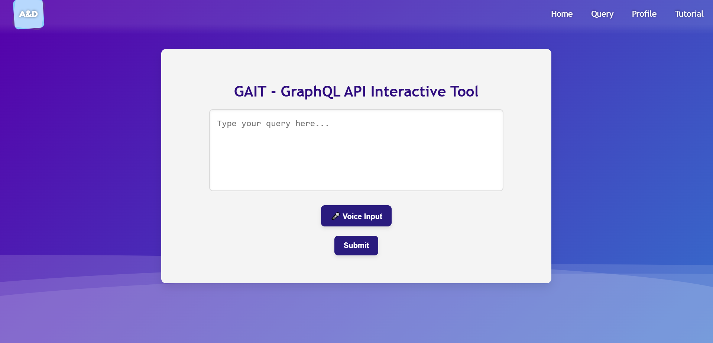

<div align="center">

  
  <h1>GAIT - GraphQL API Interactive Tool</h1>
  
  <p>
   A project developed for the WADe subject, part of the Software Engineering Master program, which aims to develop a web-based tool that enables users to interact with GraphQL APIs using natural language constructs (text or voice).
  </p>
  
  
<p>
  <a href="https://github.com/delia1205/-WADe-Project/graphs/contributors">
    
  </a>
  <a href="">
    
  </a>
  <a href="https://github.com/delia1205/-WADe-Project/network/members">
    
  </a>
  <a href="https://github.com/delia1205/-WADe-Project/stargazers">
    
  </a>
  <a href="https://github.com/delia1205/-WADe-Project/issues/">
    
  </a>
  <a href="https://github.com/delia1205/-WADe-Project/blob/master/LICENSE">
    
  </a>
</p>
   
<h4>
    <a href="demo/video-demo.mp4">View Demo</a>
  <span> · </span>
    <a href="documentation/tehnical-report.html">Documentation</a>
  <span> · </span>
    <a href="https://github.com/delia1205/-WADe-Project/issues/">Report Bug</a>
  <span> · </span>
    <a href="https://github.com/delia1205/-WADe-Project/issues/">Request Feature</a>
  </h4>
</div>

<br />

<!-- Table of Contents -->
# :notebook_with_decorative_cover: Table of Contents

- [About the Project](#star2-about-the-project)
  * [Screenshots](#camera-screenshots)
  * [Tech Stack](#space_invader-tech-stack)
  * [Features](#dart-features)
  * [Color Reference](#art-color-reference)
  * [Environment Variables](#key-environment-variables)
- [Getting Started](#toolbox-getting-started)
  * [Prerequisites](#bangbang-prerequisites)
  * [Installation](#gear-installation)
  * [Running Tests](#test_tube-running-tests)
  * [Run Locally](#running-run-locally)
  * [Deployment](#triangular_flag_on_post-deployment)
  * [Side Notes](#sidenotes)
  * [API Endpoints](#api-endpoints)
- [Usage](#eyes-usage)
- [Roadmap](#compass-roadmap)
- [License](#warning-license)
- [Contact](#handshake-contact)
- [Acknowledgements](#gem-acknowledgements)

  

<!-- About the Project -->
## :star2: About the Project

The GAIT (GraphQL API Interactive Tool) project aims to develop a web-based tool that enables users to interact with GraphQL APIs using natural language constructs (text or voice). The tool simplifies the process of querying GraphQL APIs by abstracting the complexity of writing GraphQL queries manually. Instead, users can express their requests in natural language, and the system will automatically generate and execute the corresponding GraphQL queries.

The architecture of GAIT follows a service-oriented approach, designed to process natural language queries and interact with multiple GraphQL APIs efficiently. The system consists of several core components that work together to transform user inputs into structured GraphQL queries and return meaningful results. The GAIT system is composed of three major layers: User Interface (UI), Processing Layer, and API Integration Layer.

The primary goal of this project was to create an intuitive and accessible platform that allows users to query GraphQL APIs without requiring deep technical knowledge of GraphQL syntax. By leveraging natural language processing (NLP) and voice recognition technologies, GAIT aims to simplify the process of data retrieval and interaction with APIs.

<!-- Screenshots -->
### :camera: Screenshots

<div align="center"> 
  
  
  
  
</div>


<!-- TechStack -->
### :space_invader: Tech Stack

<details>
  <summary>Client</summary>
  <ul>
    <li><a href="https://developer.mozilla.org/en-US/docs/Web/JavaScript">JavaScript</a></li>
    <li><a href="https://reactjs.org/">React.js</a></li>
    <li><a href="https://reactrouter.com/">React Router</a></li>
    <li><a href="https://axios-http.com/docs/intro">Axios</a></li>
    <li><a href="https://react-icons.github.io/react-icons/">React Icons</a></li>
    <li><a href="https://jwt.io/introduction">JSON Web Tokens</a></li>
  </ul>
</details>

<details>
  <summary>Server</summary>
  <ul>
    <li><a href="https://www.python.org/">Python</a></li>
    <li><a href="https://expressjs.com/">Express.js</a></li>
    <li><a href="https://nodejs.org/en">Node.js</a></li>
    <li><a href="https://graphql.org/">GraphQL</a></li>
    <li><a href="https://cloud.google.com/speech-to-text?hl=en">Google Speech-to-Text</a></li>
    <li><a href="https://cloud.google.com/translate/docs/reference/rest">Google Translate API</li>
  </ul>
</details>

<details>
<summary>Database</summary>
  <ul>
    <li><a href="https://www.mongodb.com/">MongoDB</a></li>
    <li><a href="https://firebase.google.com/docs/storage">Firebase Storage</a></li>
  </ul>
</details>

<details>
<summary>DevOps</summary>
  <ul>
    <li><a href="https://www.docker.com/">Docker</a></li>
  </ul>
</details>

<!-- Features -->
### :dart: Features

- **User Authentication**: Secure login functionality using credentials verified by an authentication API and a user profile database.
- **Voice Query Input**: Allows users to input queries via voice, leveraging Google’s Speech-to-Text API for conversion to text.
- **Multiple Languages Support**: Translates text input from the user into their preffered language.
- **Dynamic Query Generation**: Translates user queries into dynamic GraphQL queries via a Query Generator API, which is then sent to public GraphQL APIs for data retrieval.
- **Query History and Bookmarking**: Users can save and bookmark queries or results, which are stored in the Query History Database. They can also download results for offline access.
- **Real-time Data Retrieval**: Integrates with various public GraphQL APIs to fetch and display relevant data based on user queries.
- **Intuitive User Interface**: Front-end interface built with React, offering a seamless and responsive experience for interacting with the system.
- **Natural Language Processing (NLP)** to extract query intent.

<!-- Color Reference -->
### :art: Color Reference

| Color             | Hex                                                                |
| ----------------- | ------------------------------------------------------------------ |
| Background Colors |  #23004B  #3C50BE  #3084D2  #5500AA |
| Primary Color |  #164694 |
| Accent Color |  #9333ea |
| Text Color |  #FFFFFF |
| Button Color |  #2a1b7e |


<!-- Env Variables -->
### :key: Environment Variables

To run this project, you will need to add a `firebase.js` file with the configurations for the storage bucket.

```javascript
import { initializeApp } from "firebase/app";

// Your web app's Firebase configuration
const firebaseConfig = {
  apiKey: import.meta.env.FIREBASE_API_KEY,
  authDomain: "gait.firebaseapp.com",
  projectId: "gait",
  storageBucket: "gait.appspot.com",
  messagingSenderId: "",
  appId: "",
};

const app = initializeApp(firebaseConfig);
export default app;

```

Also, you will need to add the following environment variables to your .env file:

`FIREBASE_API_KEY`

`MONGO_URI`

`JWT_KEY`

<!-- Getting Started -->
## 	:toolbox: Getting Started -----> **TO DO**

<!-- Prerequisites -->
### :bangbang: Prerequisites -----> **TO DO**

This project uses Yarn as package manager

```bash
 npm install --global yarn
```

<!-- Installation -->
### :gear: Installation -----> **TO DO**

Install my-project with npm

```bash
  yarn install my-project
  cd my-project
```
   
<!-- Running Tests -->
### :test_tube: Running Tests -----> **TO DO**

To run tests, run the following command

```bash
  yarn test test
```

<!-- Run Locally -->
### :running: Run Locally -----> **TO DO**

Clone the project

```bash
  git clone https://github.com/Louis3797/awesome-readme-template.git
```

Go to the project directory

```bash
  cd my-project
```

Install dependencies

```bash
  yarn install
```

Start the server

```bash
  yarn start
```


<!-- Deployment -->
### :triangular_flag_on_post: Deployment -----> **TO DO**

To deploy this project run

```bash
  yarn deploy
```

<!-- Side notes -->
### :sidenotes: Side notes -----> **TO DO**


Since this project is dockerized, one can simply run

```bash
  docker --version
  docker-compose --version
```

in order to ensure Docker and Docker Compose are installed and

```bash
  docker-compose up --build
```

in order to build and run the service.

**Backend (FastAPI):** Runs on http://localhost:5000
**SPARQL Endpoint**: Runs on http://localhost:5001
**Frontend (React)**: Runs on http://localhost:3000
**Auth API (Node.js)**: Runs on http://localhost:5002

<!-- API Endpoints -->
### :api-endpoints: API Endpoints -----> **TO DO**

<div align="center"> 
  
</div>

<!-- Usage --> 
## :eyes: Usage

This section provides a step-by-step guide on how to use the GAIT platform to interact with GraphQL APIs using natural language. Whether you're a developer, analyst, or enthusiast, GAIT makes it easy to fetch data from APIs like GitHub, SpaceX, and more without writing complex GraphQL queries.

1. **Sign Up or Log In**:
   - If you're a new user, navigate to the **Sign Up** page to create an account.
   - Existing users can log in using their credentials on the **Sign In** page.

2. **Submit a Query**:
   - Once logged in, go to the **Query** page.
   - Enter your query in plain text or use the **Voice Input** button to speak your query.
   - Click **Submit** to process your query.

3. **View Results**:
   - The system will process your query, generate a GraphQL query, and fetch the results from the relevant API.
   - Results will be displayed in a user-friendly format on the **Results** page.

4. **Save and Manage Queries**:
   - You can save your queries and results for future reference by clicking the **Save** button.
   - Access your saved queries and history from the **Profile** page.

### **Example Queries**
Here are some example queries you can try:
- **SpaceX**: "What are the latest SpaceX launches?"
- **Public APIs**: "Get the current weather in New York."

### **Demo**
Check out our live demo to see GAIT in action: [GAIT Demo](https://github.com/delia1205/-WADe-Project/demo/tutorial.mp4)

### **Additional Resources**
- [API Documentation](https://github.com/delia1205/-WADe-Project/documentation/tehnical-report.html)


<!-- Roadmap -->
## :compass: Roadmap

* [x] Define Core Features
* [x] Tech Stack Decisions
* [x] Design System Architecture
* [x] Create Database Schema
* [x] Define API Specifications
* [x] UI/UX Design
* [x] Develop Backend Services
* [x] Develop Frontend Application
* [x] Unit Testing
* [x] Integration Testing
* [x] Set Up Deployment Pipeline
* [x] Documentation
* [x] Multiple Languages Support
* [x] Deploy Application
* [ ] Monitor Performance
* [ ] Bug Fixes and Updates


<!-- License -->
## :warning: License

Distributed under the no License.


<!-- Contact -->
## :handshake: Contact

Ungureanu Delia Elena - deliaungureanu2001@yahoo.com

Untu George Adrian - adrianuntu2001@gmail.com

Project Link: [https://github.com/delia1205/-WADe-Project](https://github.com/delia1205/-WADe-Project)


<!-- Acknowledgments -->
## :gem: Acknowledgements

Resources and libraries we have used in our project:

 - [Awesome README](https://github.com/matiassingers/awesome-readme)
 - [Free Frontend](https://freefrontend.com/)
 - [Google Speech-to-Text](https://cloud.google.com/speech-to-text)
 - [Firebase Storage](https://firebase.google.com/docs/storage)
 - [MongoDB](https://www.mongodb.com/)
 - [Google Translate API](https://cloud.google.com/translate/docs/reference/rest)
 - [Docker Documentation](https://docs.docker.com/)
 - [FastAPI Documentation](https://fastapi.tiangolo.com/)
 - [GraphQL Documentation](https://graphql.org/learn/)
 - [SPARQL Query Language](https://www.w3.org/TR/sparql11-query/)
 - [React Documentation](https://reactjs.org/docs/getting-started.html)
 - [RDFlib (RDF for Python)](https://rdflib.readthedocs.io/en/stable/)
 - [PyTorch Official Site](https://pytorch.org/)
 - [Langdetect (Language Detection)](https://pypi.org/project/langdetect/)
 - [i18next (Internationalization in React)](https://www.i18next.com/)
 - [Express.js (Node.js Framework)](https://expressjs.com/)
 - [Axios (HTTP Client for JavaScript)](https://axios-http.com/)
 - [Jest (Testing for JavaScript)](https://jestjs.io/)
 - [Pytest (Python Testing Framework)](https://pytest.org/)
 - [RDFlib SPARQL Query Examples](https://rdflib.readthedocs.io/en/stable/intro_to_sparql.html)
 - [Google Cloud Natural Language API](https://cloud.google.com/natural-language)
 - [OpenAI API (GPT Integration)](https://platform.openai.com/docs/)
 
